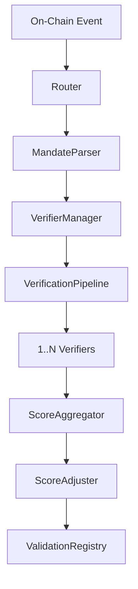

# ERC-8004 Validator MVP: Verification & Reputation Protocol

This is a minimal validation protocol built on top of the ERC-8004 Validation Registry. It produces a `0-100` reputation score for an agent task based on signed Mandates, Action Receipts, and customizable primitive constraints.

## Overview
This implementation acts as an extensible framework. Developers can drop in new validation logic for new primitives (like `bridge@1` or `mint@1`) without modifying the routing, parsing, or reputation scoring logic. 

Whenever a `ValidationRequest` is detected, the Router processes the receipt alongside the user's intent to rate the agent's performance objectively out of `100`.

---

## Quickstart

### 1. Requirements & Install
Make sure you are using Node.js version 18+:
```bash
npm install
npm run build
```

### 2. Testing the Pipeline
Execute the full End-to-End Vitest suite covering positive, negative, and edge-case execution paths.
```bash
npx vitest run
```

### 3. Demo execution
Run a simulated ValidationRequest pipeline and watch the CLI extract the resulting logs natively:
```bash
make demo
```

### 4. CLI Agent Reputation Queries
Query synthetic mock events derived from the registry using our CLI.
```bash
npx ts-node src/cli/reputation.ts reputation <agentId>
npx ts-node src/cli/reputation.ts latest <agentId>
```

---

## Architecture

The MVP is designed around a **unidirectional data flow pipeline**. This prevents tight coupling between components and ensures that adding new verification logic requires zero changes to the core engines.

### The Pipeline Pattern


### Component Responsibilities

*   **`Router`**: The entry point. Listens for events, verifies hash integrity, and orchestrates the context. Wrapped in a fail-safe `try/catch` to push `0` scores rather than crashing.
*   **`MandateParser`**: The schema gatekeeper. Enforces Zod typing, strict primitive regex formatting (`swap@1`), and validates temporal deadlines *before* execution.
*   **`VerifierManager`**: A dependency injection registry. Maps a specific `primitive` to an array of executable `Verifier` instances.
*   **`VerificationPipeline`**: The execution engine. Runs Verifiers sequentially, manages timeout bounds (`2000ms`), and handles early-exit logic (short-circuiting on Integrity failures).
*   **`Verifiers`**: Deterministic scoring modules. Evaluate the `Payload` against the `Receipt` yielding a standard `VerifierResult`.
*   **`ScoreAggregator & Adjuster`**: Pure functions. Calculate the final logic score and apply reputation modifiers (e.g. Sybil penalties).
*   **`RegistryMock`**: The data layer. Simulates an ERC-8004 smart contract environment using Node's `EventEmitter` and deep clones outputs to maintain state immutability.

---

## Testing Methodology

The architecture was explicitly designed to be testable. Because the Aggregators and Verifiers are mostly pure functions, we bypassed heavy unit testing in favor of a robust End-to-End (E2E) integration suite using `Vitest`.

The E2E suite covers 6 critical operational bounds:
1.  **Perfect Execution**: Asserts a `100` score behavior.
2.  **Fractional Deductions**: Asserts deterministic scoring (e.g., `-30` penalty for a token mismatch resulting in `85` avg).
3.  **Hash Failures**: Ensures the Router safely ignores tampered payloads.
4.  **Integrity Failures**: Proves the Pipeline accurately short-circuits.
5.  **Missing Verifiers**: Proves the Router safely catches `undefined` states and falls back to a graceful `0` rejection.
6.  **Temporal Expiration**: Proves the `MandateParser` successfully intercepts dead intents.

All tests utilize dynamically generated cryptographic signatures created in runtime using isolated `ethers.Wallet` instances to reflect actual EVM hashing mechanics.

---

## Extending the Framework

Adding support for a new primitive is straightforward. This system allows mapping `1` primitive to `N` Verifiers via the `VerifierManager`.

### 1. Create your Verifier
Implement the `Verifier` standard interface returning a `VerifierResult`:

```typescript
import { Verifier, VerifierResult, ValidationContext } from "../interfaces/verifier";

export class BridgeVerifier implements Verifier {
    name = "BridgeVerifier";

    async verify(context: ValidationContext): Promise<VerifierResult> {
        // Evaluate logic (context.payload.mandate vs context.payload.receipt)
        return { 
            verifier: this.name,
            score: 95, 
            notes: "Bridge constraints successfully met",
            evidence: { speed: "fast", gasMatched: true }
        };
    }
}
```

### 2. Register Your Verifier
Simply push it into the pipeline via your server or route initializer. The pipeline automatically evaluates it sequentially.

```typescript
import { verifierManager } from "../core/verifierManager";
import { IntegrityVerifier } from "../verifiers/integrityVerifier";
import { BridgeVerifier } from "../verifiers/bridgeVerifier";

// By assigning multiple verifiers, they run in sequence!
verifierManager.register("bridge@1", new IntegrityVerifier());
verifierManager.register("bridge@1", new BridgeVerifier());
```

---

## Example Payloads

### The Mandate Output
This is the payload output format signed by users (clients) and executing agents. Example path: `examples/swapMandate.json`

```json
{
  "core": {
    "kind": "swap@1",
    "chainId": 1,
    "deadline": 9999999999,
    "payload": {
      "tokenIn": "0xC02aaA39b223FE8D0A0e5C4F27eAD9083C756Cc2",
      "tokenOut": "0xA0b86991c6218b36c1d19D4a2e9Eb0cE3606eB48",
      "amountIn": "1000000000000000000",
      "minAmountOut": "3000000000"
    }
  },
  "signatures": {
    "client": "0x-mock-client-signature",
    "agent": "0x-mock-agent-signature"
  }
}
```

---

*This reference implementation serves as an introduction to ERC-8004 capabilities.*
